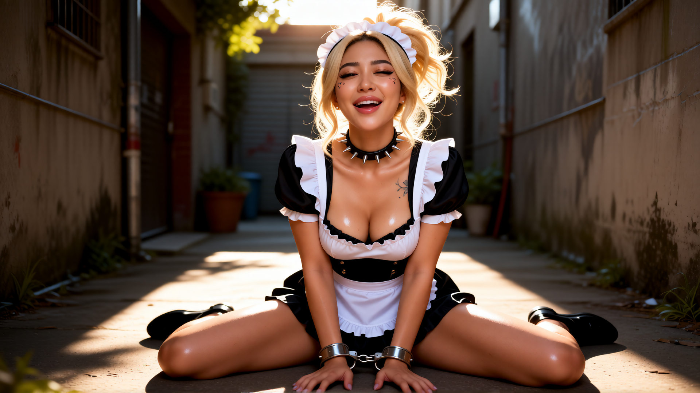

# AIO Qwen Workflow


The repository now includes:

# `AIO Comfyui-Character-Composer Qwen Workflow.json`

A unified all-in-one Qwen workflow designed around Character Composer.

This is no longer just:
- a custom node
- a tag helper
- a prompt formatter

It is effectively a lightweight procedural character-generation system for ComfyUI.

The AIO workflow combines:
- Qwen image editing
- text-to-image
- image-to-image
- structured prompting
- character consistency tools
- composition preservation
- deterministic randomization
- scene-aware prompt assembly

inside a single workflow.

---

# Why the AIO Workflow Matters


Most ComfyUI workflows eventually become:
- giant spaghetti graphs
- impossible to debug
- difficult to reproduce
- hard to share
- overloaded with manual prompt engineering

The AIO workflow was designed to behave more like:
- a game character creator
- a procedural scene builder
- a controllable generation pipeline

instead of raw prompt chaos.

It was specifically built to:
- reduce manual prompt rewriting
- stabilize generations
- preserve character identity
- simplify Qwen editing workflows
- support rapid iteration during game development

---

# Supported Modes

## Text-to-Image

Leave `image1` disconnected.

---

## Image-to-Image

Connect a source image into `image1`.

---

## Character Preservation

Use:
- `preserve_character_look`
- `outfit_mode`
- deterministic seeds

to maintain identity consistency across generations.

---

## Scene Preservation

Use:
- `preserve_input_position`

to preserve approximate:
- subject placement
- composition structure
- scene layout

---

# Main Workflow Advantages


## Unified Pipeline

No separate:
- txt2img workflow
- img2img workflow
- preservation workflow

Everything exists in one graph.

---

## Cleaner UX

The workflow behaves closer to:
- a visual character creator
- a scene editor
- a procedural composition system

than traditional prompt engineering.

---

## Structured Generation

The workflow automatically manages:
- prompt cleanup
- composition weighting
- trait balancing
- conflict resolution
- complexity reduction
- interaction stability

before the prompt even reaches Qwen.

---

## Better Iteration Speed

The workflow was built for:
- rapid testing
- asset iteration
- game prototyping
- character experimentation

without rewriting prompts every 5 minutes.

---

# Example Result



---

# Included Workflow File

```text
AIO Comfyui-Character-Composer Qwen Workflow.json
```

Recommended pairing:

```text
Qwen-Image-Edit-Rapid-AIO
```

---
## Credits / Base Workflow

This project builds upon the excellent work by [Phr00t](https://huggingface.co/Phr00t/Qwen-Image-Edit-Rapid-AIO) and the Qwen Image Edit Rapid AIO ecosystem.

The included:

`AIO Comfyui-Character-Composer Qwen Workflow.json`

is a modified and expanded version of Phr00t’s original workflow setup, adapted for structured procedural prompt composition and character-consistent generation workflows.

This repository extends the original workflow with:
- JSON-driven trait systems
- deterministic prompt composition
- smart presets
- scene conflict handling
- complexity guards
- character look preservation
- unified text-to-image and image-edit workflows

Recommended base settings from the original Qwen workflow still apply:
- CFG: `1`
- Steps: `4`
- FP8 precision
- `TextEncodeQwenImageEditPlus`

Huge respect to Phr00t for pushing the Qwen image-edit ecosystem forward.

# Additional Preview


